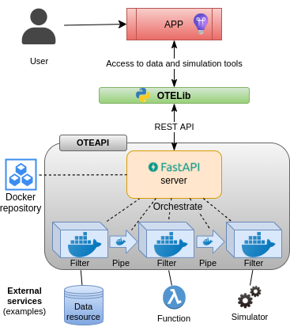
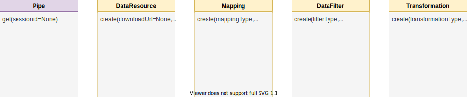
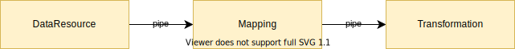

# OTELib
OTELib is a small Python library on top of the OTEAPI, that provides a simple and pythonic interface to the REST services.

It makes it very simple to configure, set up and run a pipeline based on the pipes and filter design pattern.

### Content
  * [Overview](#overview)
  * [How to use OTELib](#how-to-use-otelib)
  * [Session](#session)
  * [How to run the pore fraction example](#how-to-run-the-pore-fraction-example)
  * [License](#license)


## Overview

The OTEAPI provides a REST API for connecting a sequence of microservices into a pipeline for connecting simulation tools to data sources in a very flexible and reusable way.  OTELib provides a simple Python interface to OTEAPI that makes it easy to utilise OTEAPI from user applications and Python scripts/notebooks as illustrated in the figure below.



*__Figure:__ Overview showing how the OTELib can be used by user applications to access data and simulation tools via a simple Python interface.*


OTEAPI utilises the [pipes and
filter](https://en.wikipedia.org/wiki/Pipeline_(software)) software
design pattern to separate the process of connecting to external data resources, mapping it to a common ontology (for interoperability), data processing and running simulations into a set of reusable components.  This design provides a very high degree of flexibility and is easy to maintain due to the modularity, making it well suited for use in EU projects with distributed and loosely coupled teams.  The pipes and filters themselves are implemented as microservices that can be fetched from a docker repository.

In OTELib the pipes and filters are represented by classes - one Pipe class and currently 4 generic filter classes.  It uses the [strategy](https://en.wikipedia.org/wiki/Strategy_pattern) software design pattern is used to specify the underlying microservice.



- **Pipe:** represent data with a type and connects the output from one filter into the input of another filter. Apart from connecting filters, pipes may also have some additional features, including (not implemented yet):
  - Provide access to data and querying.
  - Performing authorisation checks.
  - Provide caching to avoid unnecessary repeating previous operations. In order to avoid unauthorised access to the cache, the cache may utilise access tokens for authorisation. If needed different caching strategies may be supported.

  Pipes will be created transparently by OTELib, so as an user, you will normally not interact with pipes.

- **DataResource:** is a filter intended to connect to external data resources and allow the user to perform operations like query, read from or write to the resource.  Where it make sense, some data resource filters may implement full CRUD (create, read, update, and delete) support.

  If the DataResource filter reads from a resource, its `get()` method will use a given data model (which may be generated on the fly) and store the content acquired data according to that.  It will return a reference to the internal data representation.

- **Mapping:** is a filter intended to map the data model describing the input to concepts in a common ontology.  The mappings themselves may either be provided during configuration of the filter or fetched from a triplestore.

- **DataFilter:** is a filter intended for fast data processing, like simple data conversions.  The `get()` method will not return before the output is generated.

- **Transformation:** is a filter intended for more time-consuming data processing, like simulations or demanding data conversions.  It supports polling and waiting for the transformation to finish.


## How to use OTELib
Lets assume that you want to set up a simple pipeline as shown in the following figure.



*__Figure:__ Generic pipeline connecting three filters, a DataResource filter, a Mapping filter and a Transformation filter via pipes.*

- The DataResource filter connects to a data resource and represents selected content from it using a data model.
- The Mapping filter maps the data model to ontologies, making the data read from the data resource fully semantically.
- The Transformation filter performs a transformation of the data, which could involve a simulation.  The result will typically be an instance of another data model.

To set up a pipeline, you will first have to connect to a running OTE server:

```python
from otelib import OTEServer
server = OTEServer('http://localhost:8080/api/v1')
```

Then you must configure the instances of the filters you want to use:

```python
dataResource = server.create_dataresource(
    downloadUrl="https://jpeg.org/images/jpegsystems-home.jpg",
    mediaType="image/jpeg")
mapping = server.create_mapping(mappingType="mapping/demo")
transformation = server.create_transformation(transformation_type= "script/dummy")
```

before you easily and elegant can combine them into a pipeline:

```python
pipeline = dataResource >> mapping >> transformation
```
Note that this also transparently creates the pipes connecting the filters.

To execute the pipeline, simply call its `get()` method:
```python
pipeline.get()
```
which will return (a reference to) the result of the last transformation.  Note that no data will be read before the `get()` method of the pipeline is called.


A pipeline can be reused and forked...
```python
filter2 = server.create_filter(filterType="filter/crop", configuration={"crop": [0,0,200,200]})
filter3 = server.create_filter(filterType="filter/blur")
pipeline2 = pipeline >> filter2
pipeline3 = pipeline >> filter3
```

... as well as merged
```python
pipeline4 = pipeline2 + pipeline3
```


### Session
A pipeline is executed by calling its `get()` method which will call the `get()` method of the last filter, which will the `get()` method of its input pipe and so forth.  Hence, a pipeline is executed upstream, from the back to the front, while the data is communicated downstream.

The purpose of a *session* is to allow the user or downstream filters to provide configurations consumed by filters further upstream.  It is implemented as a common dict shared by all pipes and filters in a pipeline.  If a session is not provided when you call the `get()` method, a new *session* will be created and passed upstream.


## How to run the pore fraction example
Prerequisites:
  - jupyter lab is installed
  - OTEAPI is running (see the [OTEAPI README](https://gitlab.cc-asp.fraunhofer.de/ontotrans/interfaces/oteapi#open-translation-environment-api) for instructions)
  - Generated a GitLab access token

    It can be generated from
    https://gitlab.cc-asp.fraunhofer.de/-/profile/personal_access_tokens
    by providing the scopes: `api`, `read_user`, `read_api`, `read_repository`


Start JupyterLab by running the following in the terminal:

    jupyter lab

In JupyterLab, open the excecute-compevo.ipynb and replace the following fields:
  - `<OTEAPI_ENDPOINT>` with http://localhost:8080/api/v1 (assuming that the OTEAPI is running on port 8080)
  - `<GITLAB_ACCESS_TOKEN>` with the to generated GitLab access token


## License
OTELib is released under the MIT license.  See [LICENSE](LICENSE) for details.
